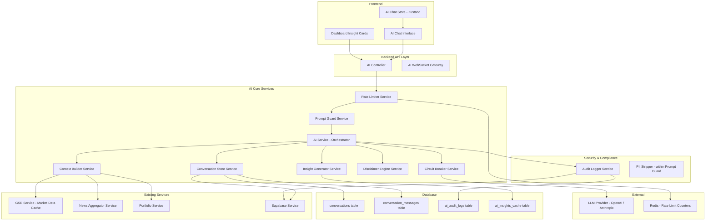
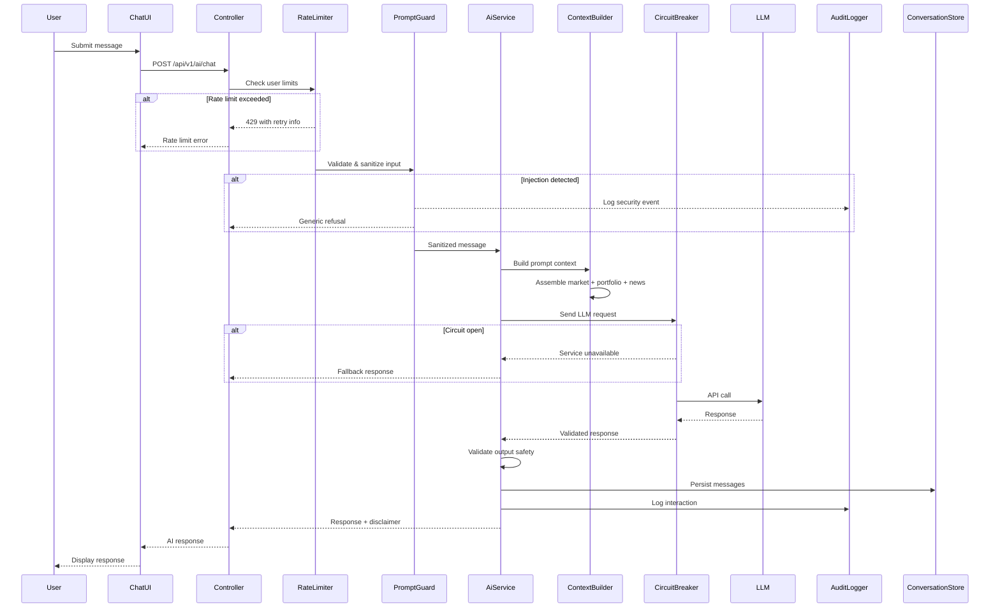

# Design Document: AI Market Intelligence

## Overview

AI Market Intelligence extends the existing GSE Trade platform with a comprehensive, secure AI assistant that contextualizes real-time Ghana Stock Exchange data, news, and user portfolio information. The system builds upon the existing `AiService`, `GseService`, `NewsAggregatorService`, and `PortfolioService` to deliver conversational AI, dashboard insight cards, and audit-compliant logging — all within a finance-grade security envelope.

The design refactors the current basic AI chat into a production-ready system with:
- **Prompt Guard** layer for injection detection and PII stripping
- **Context Builder** that assembles market data, portfolio, and news into structured LLM prompts
- **Circuit Breaker** pattern for graceful degradation when the LLM provider is unavailable
- **Rate Limiter** with per-user hourly/daily budgets
- **Conversation Store** with encrypted persistence and RLS enforcement
- **Audit Logger** for compliance with financial regulations
- **Dashboard Insight Cards** for passive market intelligence delivery

### Key Design Decisions

1. **Extend existing `ai/` module** rather than creating a new module — the current module already has LLM integration, GSE service injection, and controller routes. We refactor it into sub-services.
2. **Use Supabase PostgreSQL** for conversation storage and audit logs — consistent with the existing data layer and enables RLS enforcement.
3. **Redis for rate limiting** — the project already has the `redis` dependency; Redis provides atomic counters with TTL for sliding window rate limits.
4. **Parameterized prompt templates** — prevents injection via market data or news content by separating template structure from dynamic data.
5. **OpenAI GPT-4o-mini as primary, Anthropic Claude 3 Haiku as fallback** — matches the existing dual-provider pattern in `AiService`.

## Architecture



### Request Flow



## Components and Interfaces

### Backend Module Structure

```
backend/src/ai/
├── ai.module.ts                    # Module definition with all providers
├── ai.controller.ts                # REST endpoints
├── ai.service.ts                   # Orchestrator service
├── dto/
│   ├── chat.dto.ts                 # Chat request/response DTOs
│   ├── conversation.dto.ts         # Conversation list/detail DTOs
│   └── insight.dto.ts              # Insight card DTOs
├── services/
│   ├── prompt-guard.service.ts     # Input validation & PII stripping
│   ├── context-builder.service.ts  # Market/portfolio/news context assembly
│   ├── conversation-store.service.ts # Conversation persistence
│   ├── rate-limiter.service.ts     # Per-user rate limiting
│   ├── circuit-breaker.service.ts  # LLM provider circuit breaker
│   ├── disclaimer-engine.service.ts # Financial disclaimer attachment
│   ├── insight-generator.service.ts # Dashboard insight generation
│   └── audit-logger.service.ts     # Compliance audit logging
├── templates/
│   ├── system-prompt.template.ts   # Parameterized system prompt
│   ├── stock-query.template.ts     # Stock-specific prompt template
│   └── portfolio-query.template.ts # Portfolio analysis template
├── guards/
│   └── ai-rate-limit.guard.ts      # NestJS guard for rate limiting
├── interfaces/
│   └── ai.interfaces.ts            # TypeScript interfaces
└── constants/
    └── ai.constants.ts             # Configuration constants
```

### Frontend Structure

```
frontend/src/
├── pages/
│   └── AiChatPage.tsx              # Full-page AI chat view
├── components/
│   └── ai/
│       ├── AiChatPanel.tsx         # Chat panel (embeddable or standalone)
│       ├── AiMessageBubble.tsx     # Individual message display
│       ├── AiInputBar.tsx          # Message input with validation
│       ├── AiTypingIndicator.tsx   # Loading/typing animation
│       ├── AiConversationList.tsx  # Past conversations sidebar
│       ├── AiInsightCard.tsx       # Dashboard insight card
│       ├── AiStatusBanner.tsx      # Circuit breaker status indicator
│       └── AiDisclaimer.tsx        # Financial disclaimer component
├── store/
│   └── aiChatStore.ts              # Zustand store for AI chat state
├── hooks/
│   ├── useAiChat.ts                # React Query hook for chat mutations
│   ├── useAiConversations.ts       # React Query hook for conversation history
│   └── useAiInsights.ts           # React Query hook for dashboard insights
└── lib/
    └── aiApi.ts                    # AI-specific API client functions
```

### Key Interfaces

```typescript
// backend/src/ai/interfaces/ai.interfaces.ts

export interface ChatMessage {
  role: 'system' | 'user' | 'assistant';
  content: string;
}

export interface ConversationThread {
  id: string;
  userId: string;
  title: string;
  createdAt: string;
  updatedAt: string;
  messageCount: number;
}

export interface ConversationMessage {
  id: string;
  conversationId: string;
  role: 'user' | 'assistant';
  content: string;
  tokenCount: number;
  createdAt: string;
}

export interface PromptContext {
  marketData?: MarketDataContext;
  portfolioData?: PortfolioDataContext;
  newsData?: NewsDataContext;
  conversationHistory: ChatMessage[];
  dataFreshness: Record<string, string>;
  unavailableSources: string[];
}

export interface MarketDataContext {
  requestedStock?: {
    symbol: string;
    price: number;
    changePercent: number;
    volume: number;
  };
  compositeIndex?: number;
  topGainers: { symbol: string; changePercent: number }[];
  topLosers: { symbol: string; changePercent: number }[];
  lastUpdated: string;
}

export interface PortfolioDataContext {
  holdings: {
    symbol: string;
    quantity: number;
    averageCost: number;
    currentValue: number;
    unrealizedGainLoss: number;
  }[];
  totalValue: number;
  totalPnl: number;
}

export interface NewsDataContext {
  articles: {
    title: string;
    summary: string;
    source: string;
    publishedAt: string;
    relatedSymbols: string[];
  }[];
}

export interface InsightCard {
  id: string;
  title: string;        // max 80 chars
  summary: string;      // max 150 chars
  relevanceSymbol: string;
  disclaimer: string;
  generatedAt: string;
}

export interface AuditRecord {
  id: string;
  userId: string;
  timestamp: string;    // ISO 8601 UTC
  requestType: 'chat' | 'insight' | 'portfolio_analysis';
  tokenCount: number;
  responseStatus: 'success' | 'error' | 'timeout' | 'rate_limited' | 'rejected';
  durationMs?: number;
}

export interface SecurityEvent {
  id: string;
  userId: string;
  timestamp: string;
  sanitizedInput: string;  // max 2000 chars
  detectionReason: string;
}

export interface RateLimitInfo {
  hourlyRemaining: number;
  dailyRemaining: number;
  resetInSeconds: number;
  limitExceeded: 'hourly' | 'daily' | null;
}

export interface CircuitBreakerState {
  state: 'closed' | 'open' | 'half-open';
  failureCount: number;
  lastFailure: string | null;
  nextRetryAt: string | null;
}
```

### API Endpoints

| Method | Path | Description |
|--------|------|-------------|
| POST | `/api/v1/ai/chat` | Send a message in a conversation |
| POST | `/api/v1/ai/conversations` | Create a new conversation thread |
| GET | `/api/v1/ai/conversations` | List user's conversations |
| GET | `/api/v1/ai/conversations/:id` | Get full conversation history |
| DELETE | `/api/v1/ai/conversations/:id` | Request conversation deletion |
| GET | `/api/v1/ai/insights` | Get dashboard insight cards |
| GET | `/api/v1/ai/status` | Get AI service status (circuit breaker state) |
| GET | `/api/v1/ai/rate-limit` | Get current rate limit status |

### DTOs

```typescript
// chat.dto.ts
export class SendMessageDto {
  @IsString()
  @MinLength(1)
  @MaxLength(1000)
  message: string;

  @IsUUID()
  @IsOptional()
  conversationId?: string;
}

export class ChatResponseDto {
  conversationId: string;
  messageId: string;
  reply: string;
  disclaimer: string;
  rateLimitInfo: RateLimitInfo;
  dataSources: string[];
}
```

## Data Models

### Database Schema

```sql
-- Conversation threads
CREATE TABLE conversations (
  id UUID PRIMARY KEY DEFAULT gen_random_uuid(),
  user_id UUID NOT NULL REFERENCES auth.users(id) ON DELETE CASCADE,
  title VARCHAR(200) NOT NULL DEFAULT 'New Conversation',
  created_at TIMESTAMPTZ NOT NULL DEFAULT NOW(),
  updated_at TIMESTAMPTZ NOT NULL DEFAULT NOW(),
  message_count INTEGER NOT NULL DEFAULT 0,
  deleted_at TIMESTAMPTZ NULL,
  expires_at TIMESTAMPTZ NOT NULL DEFAULT (NOW() + INTERVAL '90 days')
);

-- Conversation messages (encrypted content at rest via Supabase TDE)
CREATE TABLE conversation_messages (
  id UUID PRIMARY KEY DEFAULT gen_random_uuid(),
  conversation_id UUID NOT NULL REFERENCES conversations(id) ON DELETE CASCADE,
  role VARCHAR(10) NOT NULL CHECK (role IN ('user', 'assistant')),
  content TEXT NOT NULL,
  token_count INTEGER NOT NULL DEFAULT 0,
  created_at TIMESTAMPTZ NOT NULL DEFAULT NOW()
);

-- AI audit logs (append-only)
CREATE TABLE ai_audit_logs (
  id UUID PRIMARY KEY DEFAULT gen_random_uuid(),
  user_id UUID NOT NULL,
  timestamp TIMESTAMPTZ NOT NULL DEFAULT NOW(),
  request_type VARCHAR(30) NOT NULL,
  token_count INTEGER NOT NULL DEFAULT 0,
  response_status VARCHAR(20) NOT NULL CHECK (
    response_status IN ('success', 'error', 'timeout', 'rate_limited', 'rejected')
  ),
  duration_ms INTEGER,
  metadata JSONB DEFAULT '{}'
);

-- Security events (append-only)
CREATE TABLE ai_security_events (
  id UUID PRIMARY KEY DEFAULT gen_random_uuid(),
  user_id UUID NOT NULL,
  timestamp TIMESTAMPTZ NOT NULL DEFAULT NOW(),
  sanitized_input VARCHAR(2000) NOT NULL,
  detection_reason VARCHAR(100) NOT NULL
);

-- Dashboard insight cache
CREATE TABLE ai_insights_cache (
  id UUID PRIMARY KEY DEFAULT gen_random_uuid(),
  user_id UUID NOT NULL REFERENCES auth.users(id) ON DELETE CASCADE,
  insights JSONB NOT NULL,
  generated_at TIMESTAMPTZ NOT NULL DEFAULT NOW(),
  expires_at TIMESTAMPTZ NOT NULL DEFAULT (NOW() + INTERVAL '24 hours')
);

-- Daily usage summaries
CREATE TABLE ai_usage_summaries (
  id UUID PRIMARY KEY DEFAULT gen_random_uuid(),
  summary_date DATE NOT NULL UNIQUE,
  total_requests INTEGER NOT NULL DEFAULT 0,
  unique_users INTEGER NOT NULL DEFAULT 0,
  avg_response_time_ms INTEGER NOT NULL DEFAULT 0,
  security_events_count INTEGER NOT NULL DEFAULT 0,
  generated_at TIMESTAMPTZ NOT NULL DEFAULT NOW()
);

-- Indexes
CREATE INDEX idx_conversations_user_id ON conversations(user_id) WHERE deleted_at IS NULL;
CREATE INDEX idx_conversations_expires_at ON conversations(expires_at);
CREATE INDEX idx_conversation_messages_conversation_id ON conversation_messages(conversation_id);
CREATE INDEX idx_ai_audit_logs_user_id ON ai_audit_logs(user_id);
CREATE INDEX idx_ai_audit_logs_timestamp ON ai_audit_logs(timestamp);
CREATE INDEX idx_ai_audit_logs_status ON ai_audit_logs(response_status);
CREATE INDEX idx_ai_security_events_user_id ON ai_security_events(user_id);
CREATE INDEX idx_ai_insights_cache_user_id ON ai_insights_cache(user_id);

-- RLS Policies
ALTER TABLE conversations ENABLE ROW LEVEL SECURITY;
ALTER TABLE conversation_messages ENABLE ROW LEVEL SECURITY;
ALTER TABLE ai_insights_cache ENABLE ROW LEVEL SECURITY;

-- Users can only see their own conversations
CREATE POLICY conversations_user_policy ON conversations
  FOR ALL USING (auth.uid() = user_id);

-- Users can only see messages in their own conversations
CREATE POLICY messages_user_policy ON conversation_messages
  FOR ALL USING (
    conversation_id IN (
      SELECT id FROM conversations WHERE user_id = auth.uid()
    )
  );

-- Users can only see their own cached insights
CREATE POLICY insights_user_policy ON ai_insights_cache
  FOR ALL USING (auth.uid() = user_id);

-- Audit logs: no direct user access (service role only)
ALTER TABLE ai_audit_logs ENABLE ROW LEVEL SECURITY;
CREATE POLICY audit_logs_service_only ON ai_audit_logs
  FOR INSERT WITH CHECK (true);
-- No SELECT/UPDATE/DELETE for application credentials

ALTER TABLE ai_security_events ENABLE ROW LEVEL SECURITY;
CREATE POLICY security_events_service_only ON ai_security_events
  FOR INSERT WITH CHECK (true);
```

### Redis Data Structures

```
# Rate limit counters (sliding window)
ai:rate:{userId}:hourly    → ZSET of timestamps (60-min window)
ai:rate:{userId}:daily     → ZSET of timestamps (24-hour window)

# Circuit breaker state
ai:circuit:state           → STRING ("closed" | "open" | "half-open")
ai:circuit:failures        → INTEGER (failure count in window)
ai:circuit:last_failure    → STRING (ISO timestamp)
ai:circuit:open_until      → STRING (ISO timestamp when to try half-open)
```


## Correctness Properties

*A property is a characteristic or behavior that should hold true across all valid executions of a system — essentially, a formal statement about what the system should do. Properties serve as the bridge between human-readable specifications and machine-verifiable correctness guarantees.*

### Property 1: Conversation context window is bounded

*For any* conversation with N messages where N > 50, the context passed to the LLM SHALL contain exactly the 50 most recent messages, preserving chronological order.

**Validates: Requirements 1.2**

### Property 2: Financial disclaimer is always appended

*For any* AI-generated response string, the output delivered to the user SHALL contain the financial disclaimer text stating the content is informational and not investment advice.

**Validates: Requirements 1.5**

### Property 3: Failed LLM preserves user message

*For any* user message and any LLM failure (error or timeout), the user's original message SHALL be persisted in the conversation thread and a fallback response SHALL be returned.

**Validates: Requirements 1.6**

### Property 4: Input sanitization and validation

*For any* input string, the Prompt Guard SHALL: (a) remove all Unicode Cc and Cf control characters, (b) collapse consecutive whitespace to a single space, (c) reject strings with fewer than 2 non-whitespace characters or exceeding 2000 characters, and (d) reject strings matching prompt injection patterns. The sanitized output SHALL never contain control characters or consecutive whitespace.

**Validates: Requirements 4.1, 4.2**

### Property 5: Stock symbol extraction includes market data

*For any* user message containing a recognized GSE stock symbol or company name, the assembled prompt context SHALL include that stock's current price, daily change percentage, and trading volume.

**Validates: Requirements 2.1**

### Property 6: Top gainers and losers correctly sorted

*For any* set of GSE market data with N stocks, the market trend context SHALL contain exactly the top 5 stocks by daily change percentage (descending) as gainers and the bottom 5 stocks by daily change percentage (ascending) as losers.

**Validates: Requirements 2.2**

### Property 7: Data freshness warning

*For any* market data with a last-updated timestamp older than 30 minutes from the current time, the context SHALL include a human-readable freshness timestamp. For data updated within 30 minutes, no freshness warning SHALL be included.

**Validates: Requirements 2.4**

### Property 8: No stock-specific data without symbol match

*For any* user message that does not contain any recognized GSE stock symbol or company name, the assembled prompt context SHALL contain no stock-specific market data (no individual stock price, change, or volume).

**Validates: Requirements 2.6**

### Property 9: Portfolio context is capped and sorted

*For any* user portfolio with N holdings where N > 0, the portfolio context SHALL include at most 20 holdings sorted by current value in descending order. Each included holding SHALL contain symbol, quantity, average purchase price, current value, and unrealized gain/loss.

**Validates: Requirements 3.1**

### Property 10: KYC gate excludes portfolio data

*For any* user who has not completed KYC verification, the prompt context SHALL contain no portfolio holdings, cost basis, or P&L figures regardless of the user's actual portfolio contents.

**Validates: Requirements 3.4**

### Property 11: PII stripping with consistent anonymization

*For any* text containing personally identifiable information (email addresses, phone numbers, Ghana Card numbers, or bank account details), the PII stripper SHALL replace each PII instance with an anonymized identifier. Within the same conversation session, the same PII value SHALL always map to the same anonymized identifier.

**Validates: Requirements 4.5**

### Property 12: Security violations produce uniform generic response

*For any* detected prompt injection attempt (role override, system prompt extraction, or delimiter injection) or unsafe LLM output (containing system prompt fragments, API keys, or internal service names), the system SHALL return the same generic refusal/safe message that does not reveal which detection rule was triggered or what specific content was flagged.

**Validates: Requirements 4.3, 4.7**

### Property 13: Rate limiting correctness

*For any* user and any sequence of request timestamps: (a) the first 30 requests within any rolling 60-minute window SHALL be accepted, (b) the first 100 requests within any rolling 24-hour window SHALL be accepted, (c) requests exceeding either limit SHALL be rejected with a response indicating which limit was exceeded and the seconds remaining until reset, and (d) one user's requests SHALL not affect another user's remaining quota.

**Validates: Requirements 5.1, 5.2, 5.3, 5.4**

### Property 14: Token budget truncation

*For any* LLM response exceeding 4000 tokens, the delivered response SHALL be truncated to exactly 4000 tokens. Responses of 4000 tokens or fewer SHALL be delivered unmodified.

**Validates: Requirements 5.5**

### Property 15: Failed requests exempt from rate limit

*For any* AI request that fails due to LLM provider unavailability or error, the user's rate limit counters SHALL remain unchanged (the failed request SHALL NOT be counted against hourly or daily limits).

**Validates: Requirements 5.7**

### Property 16: Conversation expiry calculation

*For any* conversation created at timestamp T, the expires_at value SHALL equal T + 90 days exactly.

**Validates: Requirements 6.4**

### Property 17: Insight refresh throttle

*For any* user whose insights were generated less than 4 hours ago, a subsequent dashboard load SHALL serve cached insights without triggering new LLM generation.

**Validates: Requirements 7.2**

### Property 18: Insight context assembly

*For any* user portfolio, the insight generator SHALL use at most the top 5 holdings by portfolio value. *For any* set of news articles, it SHALL include at most 5 articles whose relatedSymbols match the user's holding symbols.

**Validates: Requirements 7.3**

### Property 19: Insight card format constraints

*For any* generated insight card, the title SHALL be at most 80 characters, the summary SHALL be at most 150 characters, a relevance symbol or market event indicator SHALL be present, and a financial disclaimer SHALL be included.

**Validates: Requirements 7.4**

### Property 20: Audit record completeness and content exclusion

*For any* AI interaction, the audit record SHALL contain: user identifier, ISO 8601 UTC timestamp, request type, token count, and response status (one of: success, error, timeout, rate_limited, rejected). The audit record SHALL NOT contain the raw LLM response text.

**Validates: Requirements 8.1, 8.6**

### Property 21: Security event logging with truncation

*For any* detected security event, the audit log SHALL record the sanitized input truncated to at most 2000 characters and a detection reason string categorizing the violation type.

**Validates: Requirements 8.4**

### Property 22: Daily summary aggregation correctness

*For any* set of audit records within a calendar day, the daily summary SHALL correctly compute: total request count, count of unique user identifiers, arithmetic mean of response durations in milliseconds, and count of security events.

**Validates: Requirements 8.5**

### Property 23: News filtering by symbol and recency

*For any* stock symbol query and any set of news articles, the context SHALL include only articles whose relatedSymbols contains the queried symbol AND whose createdAt is within the last 7 days, limited to at most 3 articles.

**Validates: Requirements 9.1, 9.3**

### Property 24: Trending news selection by view count

*For any* set of news articles, the trending news context SHALL contain at most 5 articles sorted by view count in descending order, each with its associated stock symbols.

**Validates: Requirements 9.2**

### Property 25: News summary truncation

*For any* news article included in prompt context, only the summary field SHALL be used (not full content), and it SHALL be truncated to at most 200 characters.

**Validates: Requirements 9.5**

### Property 26: Unsafe LLM output rejection

*For any* LLM response containing system prompt fragments, API key patterns, internal service names, or other users' PII, the response SHALL be discarded and replaced with a generic safe message.

**Validates: Requirements 10.2**

### Property 27: Circuit breaker state machine

*For any* sequence of LLM call results (success/failure) with timestamps: (a) 5 consecutive failures within a 5-minute window SHALL transition the circuit to OPEN state, (b) after 60 seconds in OPEN state the circuit SHALL transition to HALF-OPEN, (c) a successful test request in HALF-OPEN SHALL transition to CLOSED, (d) a failed test request in HALF-OPEN SHALL transition back to OPEN for another 60 seconds.

**Validates: Requirements 10.3**

### Property 28: Unavailable data sources reported

*For any* combination of data source timeouts (market data, portfolio data, news), the AI response SHALL list exactly the sources that were unavailable, and SHALL still include context from sources that responded successfully.

**Validates: Requirements 10.5**

## Error Handling

### Error Categories and Responses

| Error Category | HTTP Status | User-Facing Message | Internal Action |
|---|---|---|---|
| Input validation failure | 400 | "Message must be between 1 and 1000 characters" | None |
| Prompt injection detected | 400 | "I can't process that request. Please rephrase your question about GSE stocks or market trends." | Audit log security event |
| Rate limit exceeded (hourly) | 429 | "You've reached the hourly limit of 30 AI requests. Try again in {seconds}s." | None |
| Rate limit exceeded (daily) | 429 | "You've reached the daily limit of 100 AI requests. Try again in {seconds}s." | None |
| LLM timeout (>5s) | 200 | "AI analysis is temporarily unavailable. Your question has been saved and you can try again shortly." | Audit log, circuit breaker increment |
| LLM error response | 200 | "AI analysis is temporarily unavailable. Your question has been saved and you can try again shortly." | Audit log, circuit breaker increment |
| Unsafe LLM output | 200 | "I wasn't able to complete that analysis. Please try rephrasing your question." | Audit log |
| Circuit breaker open | 503 | "AI features are temporarily unavailable. We're working to restore service." | None |
| Market data unavailable | 200 | Response includes note: "Note: Current market data is temporarily unavailable." | Continue with available context |
| Portfolio data unavailable | 200 | Response includes note: "Note: Portfolio data could not be loaded." | Continue with available context |
| News data unavailable | 200 | Response includes note: "Note: Recent news data is not available." | Continue with available context |
| Audit logger failure | N/A (transparent) | No user impact | Queue for retry within 5 minutes |
| Conversation not found | 404 | "Conversation not found" | None |
| Unauthorized | 401 | "Authentication required" | None |

### Circuit Breaker Implementation

```typescript
// State machine transitions
enum CircuitState {
  CLOSED = 'closed',     // Normal operation
  OPEN = 'open',         // Blocking all requests
  HALF_OPEN = 'half-open' // Testing with single request
}

// Configuration
const FAILURE_THRESHOLD = 5;       // failures to trip
const FAILURE_WINDOW_MS = 5 * 60 * 1000;  // 5-minute window
const RECOVERY_TIMEOUT_MS = 60 * 1000;     // 60-second cooldown
```

### Graceful Degradation Strategy

1. **LLM unavailable**: Return cached/fallback responses, preserve user messages
2. **Market data unavailable**: Respond with general educational content, note data gap
3. **Portfolio data unavailable**: Respond without personalization, note limitation
4. **News unavailable**: Respond without news context, note limitation
5. **Redis unavailable**: Fall back to in-memory rate limiting (less accurate but functional)
6. **Database unavailable**: Return error for persistence operations, allow stateless chat with fallback

## Testing Strategy

### Property-Based Testing

**Library**: [fast-check](https://github.com/dubzzz/fast-check) for TypeScript property-based testing

**Configuration**: Minimum 100 iterations per property test

**Tag format**: `Feature: ai-market-intelligence, Property {number}: {property_text}`

Property-based tests will cover the pure logic components:
- **Prompt Guard**: Input sanitization, PII stripping, injection detection (Properties 4, 11, 12)
- **Context Builder**: Market data assembly, portfolio capping/sorting, news filtering (Properties 5, 6, 7, 8, 9, 18, 23, 24, 25)
- **Rate Limiter**: Sliding window logic, user isolation (Properties 13, 14, 15)
- **Circuit Breaker**: State machine transitions (Property 27)
- **Disclaimer Engine**: Disclaimer attachment (Property 2)
- **Conversation Store**: Context windowing, expiry calculation (Properties 1, 16)
- **Audit Logger**: Record completeness, summary aggregation (Properties 20, 21, 22)
- **Insight Generator**: Format constraints, refresh throttle (Properties 17, 19)

### Unit Tests (Example-Based)

- Conversation creation returns UUID
- Typing indicator state transitions
- Empty portfolio returns educational content
- Circuit breaker UI status indicator
- News citation format includes source and date
- LLM timeout returns fallback within expected time
- Conversation list sorted by most recent

### Integration Tests

- End-to-end chat flow with mocked LLM
- RLS enforcement (cross-user access prevention)
- Audit log persistence and query interface
- Rate limit with Redis (actual sliding window behavior)
- Conversation persistence and retrieval
- Dashboard insight generation with real context assembly

### Smoke Tests

- System prompt template contains required constraints
- Parameterized templates used (no string concatenation)
- Audit table RLS prevents UPDATE/DELETE
- Environment variables for LLM API keys configured

### Test File Structure

```
backend/src/ai/
├── __tests__/
│   ├── prompt-guard.property.spec.ts      # Properties 4, 11, 12
│   ├── context-builder.property.spec.ts   # Properties 5, 6, 7, 8, 9, 18, 23, 24, 25
│   ├── rate-limiter.property.spec.ts      # Properties 13, 14, 15
│   ├── circuit-breaker.property.spec.ts   # Property 27
│   ├── disclaimer-engine.property.spec.ts # Property 2
│   ├── conversation-store.property.spec.ts # Properties 1, 16
│   ├── audit-logger.property.spec.ts      # Properties 20, 21, 22
│   ├── insight-generator.property.spec.ts # Properties 17, 19
│   ├── ai.service.spec.ts                 # Unit tests
│   ├── ai.controller.spec.ts             # Unit tests
│   └── ai.integration.spec.ts            # Integration tests
```
